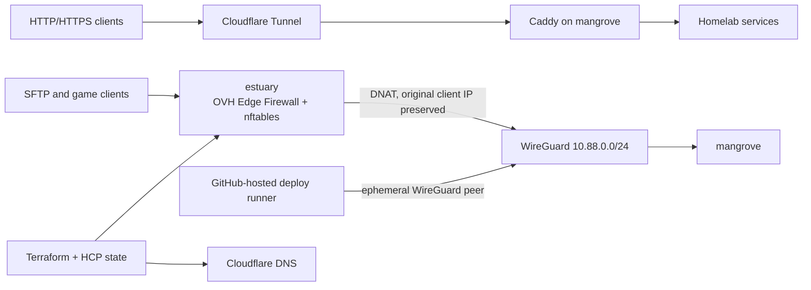

# Swamp homelab

Declarative infrastructure for two NixOS hosts:

- `mangrove` is the stateful home server and runs the application catalog.
- `estuary` is a stateless OVHcloud edge host that forwards non-HTTP traffic to `mangrove` over WireGuard.

Terraform manages the edge infrastructure, deploy-rs activates both NixOS configurations, SOPS keeps secrets host-scoped, and GitHub Actions provides the reviewed GitOps path.

## Architecture



HTTP and HTTPS continue through Cloudflare Tunnel and Caddy. Only the ports declared in [`infra/ingress.json`](infra/ingress.json) are forwarded through `estuary`:

| Traffic | Public port | Destination |
|---|---:|---|
| Pelican SFTP | TCP 2022 | `mangrove` |
| Games | TCP/UDP 25565–25575 | `mangrove` |
| WireGuard | UDP 51820 | `estuary` |

The forwarding path does not masquerade connections. Mangrove marks replies for forwarded connections and policy-routes them back through WireGuard, so applications see the real client address while unrelated traffic keeps using the home ISP.

## Hosts

| Host | Role | Address | State model |
|---|---|---|---|
| `mangrove` | Applications, storage, monitoring, home ingress | LAN `10.0.0.2`, WireGuard `10.88.0.2` | Impermanent root with persistent data |
| `estuary` | Public WireGuard hub and non-HTTP ingress | WireGuard `10.88.0.1` | Reproducible and stateless |
| GitHub deploy peer | Temporary deploy-rs access | WireGuard `10.88.0.3` | Created and removed per production run |

Estuary is an OVHcloud VPS-1 in Hillsboro. Terraform selects the current monthly plan and mandatory options from the live catalog, refuses a combined recurring price of $10 or more, and protects the VPS from accidental destruction.

## Security and observability

- Public TCP 22 on Estuary is dropped by nftables before it reaches SSH. Administration and deployments use WireGuard.
- Every public SSH probe is counted in Prometheus. Rate-limited samples are enriched locally with DB-IP City Lite, shipped to Loki, and displayed on the **Security — Estuary SSH Probes** Grafana map.
- Mangrove Fail2ban bans are exported to Prometheus and geolocated into the **Security — Fail2ban** dashboard.
- Vector ships systemd, Fail2ban, and Suricata events to Loki without using IP addresses as high-cardinality stream labels.
- Prometheus monitors both hosts, WireGuard handshake age, public ingress, Fail2ban exporters, and log shipping.
- Suricata provides alert-focused network IDS telemetry on Mangrove.

GeoIP locations are approximate. DB-IP attribution is included in both map dashboards.

## Services on Mangrove

| Service | URL | Purpose |
|---|---|---|
| Authentik | `auth.schenkenberger.dev` | Identity provider and SSO |
| Grafana | `grafana.schenkenberger.dev` | Metrics, logs, alerts, and security maps |
| Coder | `coder.schenkenberger.dev` | Remote development workspaces |
| Pelican | `panel.schenkenberger.dev` | Game server panel and Wings |
| Jellyfin | `jellyfin.schenkenberger.dev` | Media server |
| Seerr | `seerr.schenkenberger.dev` | Media requests |
| Sonarr / Radarr / Prowlarr | service subdomains | Media automation |
| qBittorrent | `qbit.schenkenberger.dev` | VPN-routed downloads |
| RomM | `romm.schenkenberger.dev` | ROM library |
| Mealie | `mealie.schenkenberger.dev` | Recipes |
| Actual Budget | `actual.schenkenberger.dev` | Budgeting |
| Wealthfolio | `wealthfolio.schenkenberger.dev` | Portfolio tracking |
| Tilt | `tilt.schenkenberger.dev` | Fermentation monitoring |
| Copyparty | `files.schenkenberger.dev` | File access |
| Frigate | `frigate.schenkenberger.dev` | Camera NVR |
| Home Assistant | `homeassistant.schenkenberger.dev` | Home automation |
| VM console | `console.schenkenberger.dev` | Gaming VM console |

Most web applications are protected by Authentik through Caddy.

## Infrastructure and repository layout

```text
hosts/
  estuary/                Edge host and disk layout
  mangrove/               Home server and disk layout
infra/
  ingress.json            Shared public-ingress contract
  terraform/              OVH VPS/firewall and Cloudflare DNS
modules/
  common/                  Host-neutral base, WireGuard, and GeoIP data
  nixos/                   Mangrove services, networking, and monitoring
secrets/                   SOPS-encrypted host and service secrets
tests/
  estuary-ingress.nix     Three-node forwarding and policy-routing VM test
```

Terraform state is remotely locked and versioned in the HCP Terraform organization `davisschenk-homelab`, workspace `nixos-homelab-production`. Terraform manages the Estuary VPS, OVH edge firewall, and DNS-only `play.schenkenberger.dev` and `*.mc.schenkenberger.dev` records. The existing Cloudflare Tunnel and root wildcard DNS remain outside Terraform.

Selected Pelican servers and native Infrarust routes can be managed through the [declarative game-server catalog](docs/game-servers.md).

## Development workflow

Install Nix with flakes enabled and `just`. Before opening a PR:

```bash
just fmt-check
just lint
```

Run validation that matches the risk of the change:

```bash
just validate-ingress   # infra/ingress.json or its validator
just build-estuary      # Estuary configuration changes
just build              # Mangrove configuration changes
just test-ingress       # WireGuard, nftables, DNAT, or policy routing
just check              # broad flake/deploy-rs evaluation when needed
```

PR CI is path-filtered. Nix changes receive formatting and lint checks without full system builds; Terraform changes receive formatting, validation, a speculative plan, and a protected production apply before merge. Fork PRs never receive production credentials.

A protected push to `master` runs the production sequence:

1. Validate ingress and Terraform.
2. Recompute the production Terraform plan.
3. Pass the protected `production` environment gate.
4. Apply the reviewed plan.
5. Join WireGuard from the ephemeral GitHub-hosted runner.
6. Deploy `estuary`, then `mangrove`, with deploy-rs rollback protection.
7. Remove the runner's WireGuard and SSH keys.

Manual `just deploy` remains available for bootstrap or recovery, but normal changes flow through the reviewed production workflow. See [`AGENTS.md`](AGENTS.md) for repository conventions.

## Secrets

SOPS encrypts service credentials and host WireGuard private keys with age recipients. Mangrove and Estuary have separate identities; Estuary cannot decrypt Mangrove service secrets. Administrative recovery keys are backed up in Bitwarden Secrets Manager, while CI WireGuard and SSH deployment keys live only in the protected GitHub `production` environment.

Useful commands:

```bash
just bootstrap-age-key
just edit <secret>
just view <secret>
just rekey
just check-secrets
```

Never commit plaintext credentials or age private keys.

## Bootstrap and recovery

- [`docs/estuary-bootstrap.md`](docs/estuary-bootstrap.md) covers Terraform creation, nixos-anywhere installation, WireGuard bring-up, and closing bootstrap SSH.
- `just build-iso` builds the destructive Mangrove installer ISO. The generated `install-mangrove` command erases the configured NVMe and HDD, so verify device IDs before using it.
- Mangrove persists `/persist`, `/nix`, `/home`, `/var/log`, and application data while recreating its root subvolume on boot.
- Email hosting remains deliberately separate from Estuary; applications continue using an authenticated SMTP relay.
